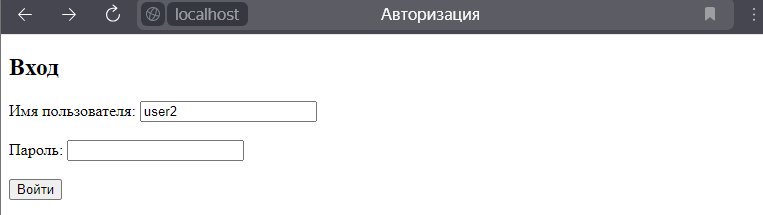
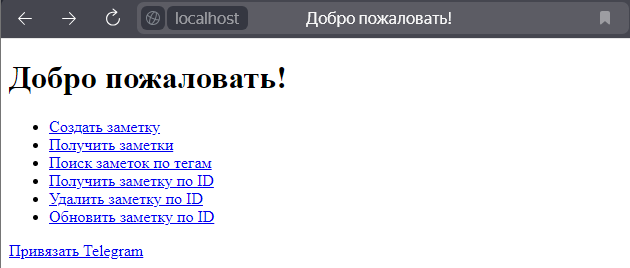
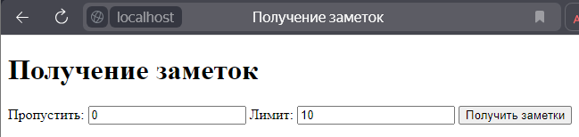
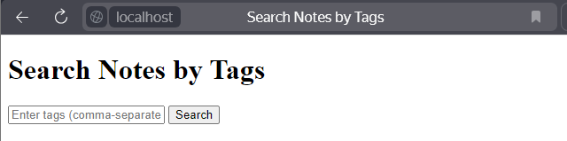
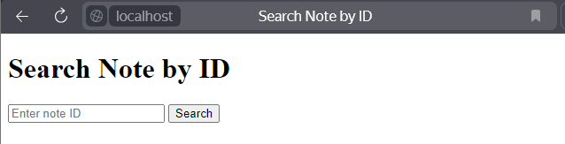
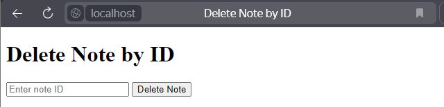
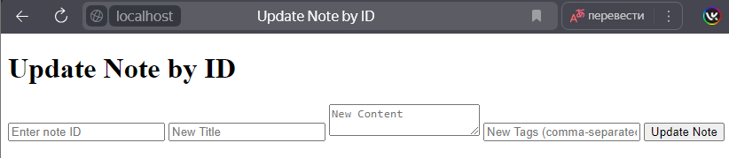

# Описание проекта

Управление заметками пользователя. Возможно авторизоваться через Telegram (немного не дотянул связывание :()

### Стек:
- FastAPI
- PostgreSQL
- aiogram
- Jinja
- SQLAlchemy
- Pydantic
- JWT
- Python

#### Страница входа

#### Главная страница

#### Создание заметки

#### Получение заметок

#### Поиск заметок

#### Получить заметку по ID

#### Удалить заметку

#### Обновить заметку

### Зависимости
- JWT
- FastAPI
- aiogram==2.9
- Pydantic
- SQLAlchemy
- httpx
- Uvicorn
- Psycopg2